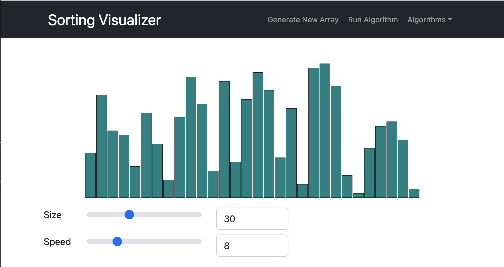

# Sorting Visualizer

This project visually shows the steps of different sorting algorithms on an array.
  
Click here for a [Live Demo](https://tvdao.github.io/sortingVisualizer/)
  

## Overview:

This project visualizes popular sorting algorithms such as bubble sort, merge sort, etc.  
The size of the array can be adjusted as well as the speed of the visualization.  
The app was all built in React.

## Intro:

I built this project to get a better understanding on common sorting algorithms.  
I thought creating a visual representation would help support me the most in understanding since I am a visual learner. 

## Meet The Algorithms:

### Bubble Sort
- Repeatedly swaps the adjacent element if they are in the wrong order.
- Time: O(N^2)
- Space: O(1)
  

### Insertion Sort
- Conceptually, the algorithm splits the array into 2 parts, unsorted and sorted. Values from the unsorted are put into the correct position in the sorted part.
- Time: O(N^2)
- Space: O(1)
  

### Selection Sort
- Starting at index i, it grabs the smallest element from the subarray: [i, length of array] for 0 <= i < length of array.
- Time: O(N^2)
- Space: O(1)
  

### Merge Sort
- Divided the array into smaller subarrays, sorting each subarray, and then merges the sorted subarrays.
- Time: O(nlogn)
- Space: O(n)
  